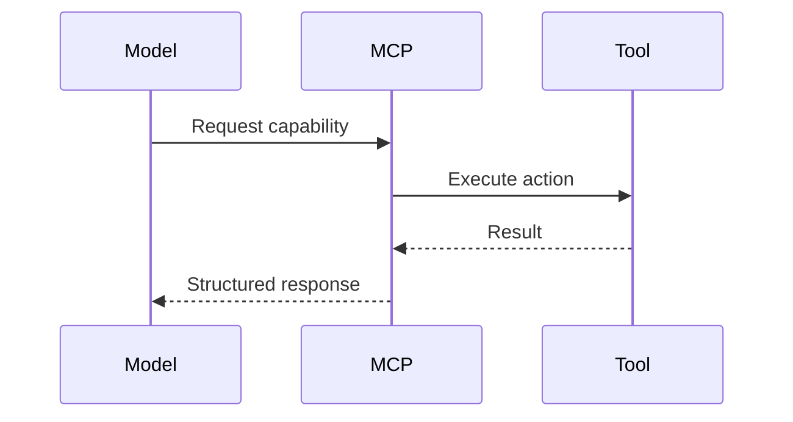

I've built enough MCP servers to know what works and what doesn't. The specification gives you the basics, but production systems require patterns that go beyond the happy path.

Here are the five patterns I use in every production MCP server.

### MCP Request Flow



## Pattern 1: Tool-First Design

When building an MCP server, the temptation is to think about your data first—what resources you want to expose, what information you have. This leads to resource-heavy servers that agents struggle to use effectively.

Instead, design around tools.

### Why Tools Over Resources

Tools are imperative—they do things. Resources are declarative—they represent things. Agents think in terms of actions, not entities.

Compare these approaches:

**Resource-first (harder for agents):**
```typescript
// Agent has to figure out what to do with this
{
  uri: "database://users/123",
  content: { id: 123, name: "Alice", role: "admin" }
}
```

**Tool-first (clear action):**
```typescript
// Agent knows exactly what this does
{
  name: "update_user_role",
  description: "Change a user's role in the system",
  inputSchema: {
    type: "object",
    properties: {
      userId: { type: "number" },
      newRole: { type: "string", enum: ["user", "admin", "moderator"] }
    }
  }
}
```

The tool communicates intent. The resource just exposes data.

### Implementation Pattern

Start with tools. Add resources only when you need to expose structured data for context.

```typescript
// Good: Clear, action-oriented tools
server.setRequestHandler(CallToolRequestSchema, async (request) => {
  const { name, arguments: args } = request.params;

  switch (name) {
    case "search_users":
      return await searchUsers(args.query, args.limit);

    case "update_user":
      return await updateUser(args.userId, args.updates);

    case "assign_role":
      return await assignRole(args.userId, args.role);
  }
});
```

Each tool does one thing well, with clear inputs and outputs.

## Pattern 2: Graceful Degradation

External dependencies fail. APIs timeout. Databases become unavailable. Your MCP server needs to handle these gracefully without crashing.

### The Circuit Breaker Pattern

Implement circuit breakers for all external calls:

```typescript
class CircuitBreaker {
  private failures = 0;
  private lastFailTime = 0;
  private state: 'closed' | 'open' | 'half-open' = 'closed';

  async execute<T>(fn: () => Promise<T>): Promise<T> {
    if (this.state === 'open') {
      if (Date.now() - this.lastFailTime > 60000) {
        this.state = 'half-open';
      } else {
        throw new Error('Circuit breaker is open');
      }
    }

    try {
      const result = await fn();
      if (this.state === 'half-open') {
        this.state = 'closed';
        this.failures = 0;
      }
      return result;
    } catch (error) {
      this.failures++;
      this.lastFailTime = Date.now();

      if (this.failures >= 5) {
        this.state = 'open';
      }
      throw error;
    }
  }
}
```

### Fallback Responses

When a dependency fails, provide useful fallback information:

```typescript
async function callTool(name: string, args: any) {
  try {
    return await breaker.execute(() => externalAPI.call(name, args));
  } catch (error) {
    // Don't just fail—give the agent alternatives
    return {
      content: [{
        type: "text",
        text: `Service temporarily unavailable. You can:
        1. Try again in a few moments
        2. Use the 'get_cached_data' tool for recent data
        3. Check service status at status.example.com`
      }],
      isError: true
    };
  }
}
```

The agent gets actionable information, not just an error.

## Pattern 3: Strategic Caching

MCP servers often call expensive APIs or databases. Naive caching can lead to stale data. No caching leads to rate limits and slow responses.

### Cache with TTL and Invalidation

```typescript
class CacheManager {
  private cache = new Map<string, { data: any; expires: number }>();

  async get<T>(
    key: string,
    fetcher: () => Promise<T>,
    ttl: number = 300000 // 5 minutes default
  ): Promise<T> {
    const cached = this.cache.get(key);

    if (cached && cached.expires > Date.now()) {
      return cached.data;
    }

    const data = await fetcher();
    this.cache.set(key, {
      data,
      expires: Date.now() + ttl
    });

    return data;
  }

  invalidate(pattern: string) {
    // Invalidate by pattern
    for (const [key] of this.cache) {
      if (key.includes(pattern)) {
        this.cache.delete(key);
      }
    }
  }
}
```

### Cache Invalidation on Writes

When a tool modifies data, invalidate related cache entries:

```typescript
async function updateUser(userId: number, updates: any) {
  await database.users.update(userId, updates);

  // Invalidate caches that might be affected
  cache.invalidate(`user:${userId}`);
  cache.invalidate('users:list');

  return { success: true };
}
```

This keeps your server fast without serving stale data.

## Pattern 4: Structured Error Handling

Generic error messages help no one. Agents need structured errors they can reason about.

### Error Response Schema

```typescript
type ToolError = {
  code: string;
  message: string;
  retryable: boolean;
  retryAfter?: number;
  details?: Record<string, any>;
};

function formatError(error: unknown): ToolError {
  if (error instanceof ValidationError) {
    return {
      code: 'VALIDATION_ERROR',
      message: error.message,
      retryable: false,
      details: { fields: error.fields }
    };
  }

  if (error instanceof RateLimitError) {
    return {
      code: 'RATE_LIMIT',
      message: 'Rate limit exceeded',
      retryable: true,
      retryAfter: error.retryAfter
    };
  }

  if (error instanceof NetworkError) {
    return {
      code: 'NETWORK_ERROR',
      message: 'Network request failed',
      retryable: true,
      retryAfter: 5000
    };
  }

  return {
    code: 'INTERNAL_ERROR',
    message: 'An unexpected error occurred',
    retryable: false
  };
}
```

### Using Structured Errors

```typescript
server.setRequestHandler(CallToolRequestSchema, async (request) => {
  try {
    const result = await executeToolSafely(request.params);
    return {
      content: [{ type: "text", text: JSON.stringify(result) }]
    };
  } catch (error) {
    const structuredError = formatError(error);
    return {
      content: [{
        type: "text",
        text: JSON.stringify(structuredError)
      }],
      isError: true
    };
  }
});
```

Now agents know:
- What went wrong
- Whether to retry
- How long to wait before retrying
- What details might help debug the issue

## Pattern 5: Comprehensive Testing

MCP servers are mission-critical infrastructure. Test them like it.

### Unit Tests for Tools

```typescript
describe('search_users tool', () => {
  it('should return matching users', async () => {
    const result = await callTool('search_users', {
      query: 'alice',
      limit: 10
    });

    expect(result.users).toHaveLength(1);
    expect(result.users[0].name).toBe('Alice');
  });

  it('should handle empty results', async () => {
    const result = await callTool('search_users', {
      query: 'nonexistent',
      limit: 10
    });

    expect(result.users).toHaveLength(0);
  });

  it('should validate query length', async () => {
    await expect(
      callTool('search_users', { query: 'a', limit: 10 })
    ).rejects.toThrow('Query must be at least 2 characters');
  });
});
```

### Integration Tests with Mock Clients

```typescript
describe('MCP Server Integration', () => {
  let client: Client;
  let server: Server;

  beforeEach(async () => {
    [client, server] = await createTestClientServer();
  });

  it('should list available tools', async () => {
    const response = await client.listTools();
    const toolNames = response.tools.map(t => t.name);

    expect(toolNames).toContain('search_users');
    expect(toolNames).toContain('update_user');
  });

  it('should execute tools successfully', async () => {
    const result = await client.callTool({
      name: 'search_users',
      arguments: { query: 'test', limit: 5 }
    });

    expect(result.content).toBeDefined();
    expect(result.isError).toBeFalsy();
  });
});
```

### Error Scenario Testing

Don't just test the happy path:

```typescript
it('should handle database failures gracefully', async () => {
  // Simulate database down
  mockDB.simulateFailure();

  const result = await client.callTool({
    name: 'get_user',
    arguments: { userId: 123 }
  });

  expect(result.isError).toBe(true);
  const error = JSON.parse(result.content[0].text);
  expect(error.code).toBe('DATABASE_ERROR');
  expect(error.retryable).toBe(true);
});
```

## Putting It All Together

These patterns work together to create robust MCP servers:

1. **Tool-first design** makes your server intuitive for agents
2. **Graceful degradation** keeps it running when dependencies fail
3. **Strategic caching** keeps it fast without serving stale data
4. **Structured errors** help agents recover from failures
5. **Comprehensive testing** ensures reliability

Here's a production-ready tool implementation using all five patterns:

```typescript
const userCache = new CacheManager();
const apiBreaker = new CircuitBreaker();

server.setRequestHandler(CallToolRequestSchema, async (request) => {
  const { name, arguments: args } = request.params;

  try {
    if (name === 'get_user') {
      // Pattern 3: Caching
      const user = await userCache.get(
        `user:${args.userId}`,
        async () => {
          // Pattern 2: Circuit breaker
          return await apiBreaker.execute(() =>
            database.users.findById(args.userId)
          );
        },
        300000 // 5 minute TTL
      );

      return {
        content: [{ type: "text", text: JSON.stringify(user) }]
      };
    }
  } catch (error) {
    // Pattern 4: Structured errors
    const structuredError = formatError(error);
    return {
      content: [{
        type: "text",
        text: JSON.stringify(structuredError)
      }],
      isError: true
    };
  }
});
```

## Start Using These Patterns Today

You don't need to implement all patterns at once. Start with tool-first design and add the others as your server matures.

The difference between a prototype MCP server and a production-ready one is attention to these details. Error handling. Caching. Testing. Graceful degradation.

These patterns are what make MCP servers reliable enough to bet your infrastructure on.

---

Want to learn more about building production MCP servers? Check out my [comprehensive course](/), or reach out on [X](https://x.com/iamnewyorknick) to discuss your specific use case.
