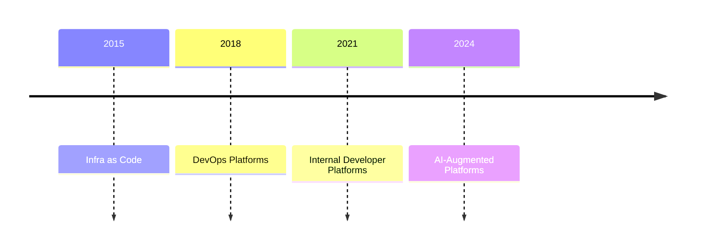

Platform engineering has always been about enabling developers to move faster while maintaining guardrails. Self-service infrastructure, golden paths, and developer portals—these are the tools we've used to scale engineering organizations.

But AI agents are changing the game entirely.

### Platform Engineering Evolution



## The Traditional Platform Engineering Model

For the past decade, platform engineering has focused on reducing friction for human developers. We built:

- **Service catalogs** where developers browse templates
- **Self-service portals** where they click buttons to provision resources
- **Golden paths** that codify best practices into reusable patterns
- **Developer portals** like Backstage that centralize these capabilities

The goal was always the same: make it easy for developers to do the right thing, and hard to do the wrong thing.

This model worked. DevOps metrics improved, deployment frequency increased, and teams scaled. But it was fundamentally built for human consumers—developers who read documentation, click through UIs, and follow tutorials.

## Enter AI Agents

Now we have a new consumer: AI agents that can provision infrastructure, deploy services, query metrics, and orchestrate complex workflows—all through natural language.

This isn't just an incremental improvement. It's a fundamental shift in how platforms are consumed.

### Agents as Platform Consumers

Unlike human developers, AI agents:
- Don't read documentation (they need machine-readable schemas)
- Don't click through UIs (they make API calls)
- Don't follow step-by-step guides (they reason about multi-step workflows)
- Don't browse catalogs (they query for capabilities)

Your beautiful Backstage portal? Not optimized for agents.
Your comprehensive documentation? Not how agents learn.
Your golden path templates? Agents need something more dynamic.

## What Changes for Platform Engineering

If agents are becoming primary platform consumers, we need to rethink our approach:

### 1. API-First Everything

Every platform capability needs a programmatic interface. Not just REST APIs—agent-friendly APIs with:

- Clear, consistent naming conventions
- Descriptive error messages that agents can act on
- Idempotent operations for safe retries
- Composable endpoints for complex workflows

The UI becomes secondary. The API becomes the platform.

### 2. Machine-Readable Service Catalogs

Instead of markdown documentation and web interfaces, agents need:

```json
{
  "capabilities": [
    {
      "name": "provision-database",
      "description": "Provision a PostgreSQL database instance",
      "inputSchema": {
        "type": "object",
        "properties": {
          "name": { "type": "string" },
          "size": { "enum": ["small", "medium", "large"] },
          "environment": { "enum": ["dev", "staging", "prod"] }
        }
      },
      "requiredApprovals": ["team-lead"],
      "estimatedDuration": "5m"
    }
  ]
}
```

This is where MCP enters the picture. Every platform capability becomes an MCP tool that agents can discover and use.

### 3. Observability for AI

When an agent provisions infrastructure or deploys a service, you need visibility into:
- What the agent intended to do
- What it actually did
- Why it made those choices
- What context it had access to

Traditional observability isn't enough. You need agent-specific telemetry:
- Tool call traces showing the agent's decision tree
- Context snapshots showing what information the agent had
- Approval flows for sensitive operations
- Audit logs that explain agent actions in human terms

### 4. Agent-Friendly Golden Paths

Golden paths need to evolve from "here's a template you can copy" to "here's a pattern the agent can reason about."

Instead of:
```yaml
# Copy this template and fill in the values
service:
  name: YOUR_SERVICE_NAME
  replicas: 3
```

Think:
```typescript
// MCP tool that encodes the golden path
{
  name: "deploy-service",
  description: "Deploy a service following company best practices",
  inputSchema: {
    // The schema IS the golden path
    // It encodes architectural decisions, security requirements, observability patterns
  }
}
```

The golden path becomes executable policy, not documentation.

## The Convergence: Platform Engineering + AI Infrastructure

Platform engineering and AI infrastructure are converging into a unified discipline. The skills are remarkably similar:

- **Platform engineers** already build self-service APIs, manage complex orchestration, and think about developer experience
- **AI infrastructure engineers** build tool servers, manage agent orchestration, and think about agent experience

These are the same problems with different consumers.

The winning platform teams in 2025 will be those who:
1. Expose all platform capabilities through MCP servers
2. Build agent-first APIs while maintaining human-friendly UIs
3. Implement observability that works for both human and agent actions
4. Design golden paths that agents can interpret and follow
5. Create approval workflows that trust but verify agent actions

## Real-World Patterns Emerging

I'm seeing these patterns emerge in production environments:

### Pattern 1: Dual Interfaces

Platforms exposing the same capabilities through:
- MCP servers for agents
- Web UIs for humans
- GraphQL/REST APIs for programmatic access

All backed by the same core services.

### Pattern 2: Agent Approval Flows

Critical operations require human approval, but agents can:
- Prepare the request with full context
- Explain the rationale
- Wait for approval
- Execute once authorized
- Report results back

### Pattern 3: Platform Agents

Instead of replacing humans, agents act as platform assistants:
- "Deploy this service following our golden path"
- "Scale this service based on current load"
- "Investigate why this deployment failed"
- "Show me all infrastructure costs by team"

The agent understands the platform, the platform trusts the agent.

## What This Means for 2025 and Beyond

The future of platform engineering isn't replacing humans with agents. It's building platforms that serve both, seamlessly.

Key predictions:
- **MCP becomes the standard platform interface**: Just like OpenAPI became the standard for REST APIs, MCP will become the standard for platform capabilities
- **Agent-first design**: New platforms will be designed for agents first, with human interfaces as a secondary concern
- **Platform AI assistants become standard**: Every major platform will have an AI assistant that helps with onboarding, troubleshooting, and complex operations
- **Governance evolves**: Policy-as-code and approval workflows that work for both human and agent actions

## Getting Started

If you're building or managing a platform, start preparing now:

1. **Audit your APIs**: Are they agent-friendly? Clear descriptions? Good error messages?
2. **Catalog your capabilities**: What should agents be able to do? What needs human approval?
3. **Build one MCP server**: Pick one platform capability and expose it through MCP
4. **Test with an agent**: Use Claude Desktop or a custom agent to interact with your platform
5. **Iterate on the experience**: What's confusing? What needs better documentation in the schema?

The transition to agent-friendly platforms won't happen overnight, but it's happening. The platform teams that start now will have a significant advantage.

## The Opportunity

This is a rare moment where a new paradigm is emerging, but the patterns haven't fully solidified. If you're in platform engineering, you have the opportunity to shape how this evolves.

We're not just building platforms anymore. We're building the infrastructure that intelligent systems will use to build, deploy, and operate software.

That's the future of platform engineering. And it's already here.

---

Building agent-friendly platforms? I'd love to hear about your challenges and patterns. Reach out on [X](https://x.com/iamnewyorknick) or [LinkedIn](https://linkedin.com/in/nicktreffiletti).
