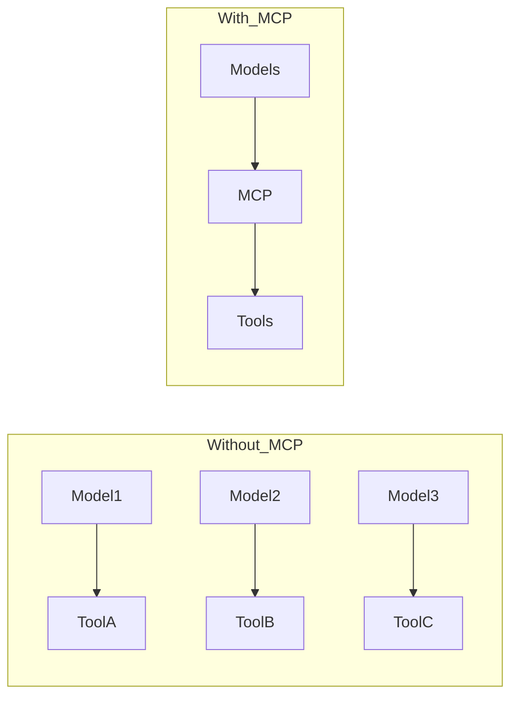

The AI tooling landscape has been fragmented. Every LLM provider, every framework, every platform has its own way of handling tool calls, context management, and integration patterns. It's the kind of fragmentation that slows innovation and creates unnecessary complexity for developers.

Then Anthropic introduced the Model Context Protocol (MCP), and everything changed.

## What MCP Actually Is

At its core, MCP is a standardized protocol for connecting AI systems to external tools and data sources. Think of it as a universal adapter between AI agents and the world around them.

Instead of building custom integrations for every LLM and every tool, you build an MCP server once. That server can then be consumed by any MCP-compatible client—whether that's Claude Desktop, a custom agent framework, or an enterprise AI platform.

Here's a minimal example of an MCP tool definition:

```typescript
server.setRequestHandler(ListToolsRequestSchema, async () => ({
  tools: [{
    name: "get_weather",
    description: "Get current weather for a location",
    inputSchema: {
      type: "object",
      properties: {
        location: {
          type: "string",
          description: "City name or coordinates"
        }
      },
      required: ["location"]
    }
  }]
}));
```

Clean, declarative, and framework-agnostic.

## The Problem MCP Solves

Before MCP, every AI integration was bespoke. Want to connect Claude to your database? Custom integration. Want to give GPT-4 access to your CRM? Another custom integration. Building a multi-agent system? Good luck maintaining consistency across different tool-calling formats.

This fragmentation had real costs:
- **Development overhead**: Teams reinventing the wheel for every new AI feature
- **Maintenance burden**: Every LLM update potentially breaking integrations
- **Limited reusability**: Tools built for one framework don't work with another
- **Poor discoverability**: No standard way to share or discover AI tools

MCP changes this equation entirely.

### Integration Complexity: Before and After MCP



## Why It's Gaining Traction

Three factors are accelerating MCP adoption:

### 1. Anthropic's Commitment

Anthropic isn't just promoting MCP—they're using it in production. Claude Desktop runs entirely on MCP servers. When a company with Anthropic's resources and reputation bets this heavily on a protocol, developers pay attention.

### 2. Open Specification

MCP is fully open. The specification is public, implementations are open source, and anyone can build MCP servers or clients. This openness creates network effects—the more tools available as MCP servers, the more valuable MCP clients become.

### 3. Growing Ecosystem

In just months since launch, we've seen:
- Official SDKs for TypeScript and Python
- Community servers for databases, APIs, file systems, and more
- Integration into popular AI frameworks
- Enterprise adoption for internal tool standardization

The ecosystem is hitting critical mass.

## Where This Goes Next

I see MCP becoming the de facto standard for AI tool integration, similar to how OpenAPI became the standard for REST APIs. Here's my prediction for 2025:

**Enterprise Adoption**: Large organizations will standardize on MCP for their internal AI platforms. Instead of managing dozens of custom integrations, platform teams will maintain a catalog of MCP servers that any AI application can consume.

**Developer Platforms**: Internal developer platforms will expose their capabilities through MCP. Want to provision infrastructure? Deploy services? Query metrics? There's an MCP server for that.

**Agentic Workflows**: Multi-agent systems will use MCP as their standard tool interface, making it trivial to share capabilities between agents and compose complex workflows.

**Tool Marketplaces**: We'll see marketplaces emerge where developers publish and share MCP servers, similar to npm or PyPI but for AI tools.

## Why I'm All In

I'm betting on MCP because it solves a real problem in an elegant way. It's not trying to be a full framework or platform—it's doing one thing exceptionally well: standardizing how AI systems access tools and data.

For developers, this means:
- Write once, use everywhere
- Plug into a growing ecosystem
- Focus on building great tools, not managing integrations
- Future-proof your AI infrastructure

For organizations, this means:
- Reduced integration complexity
- Faster time to market for AI features
- Reusable tool libraries across teams
- Clear governance and security boundaries

## Getting Started

If you're building AI-powered applications, now is the time to explore MCP. Start simple:

1. **Build a read-only server**: Expose some data through MCP resources
2. **Add a simple tool**: Create one useful tool your AI agent can call
3. **Test with Claude Desktop**: See your tools in action immediately
4. **Expand gradually**: Add more tools, handle edge cases, improve error handling

The beauty of MCP is that you can start small and grow incrementally. Each MCP server you build becomes a reusable asset for your entire AI infrastructure.

The protocol is still young, patterns are still emerging, and the ecosystem is still forming. But the direction is clear: MCP is becoming the standard way to build AI tool integrations.

I'm not just watching this happen—I'm actively building on MCP, sharing patterns, and helping shape how it's used in production environments. The opportunity to influence a foundational protocol in the AI era doesn't come often.

That's why I'm betting big on MCP. The question is: are you?

---

Want to dive deeper into MCP server development? Check out my [course on building production-ready MCP servers](/), or reach out on [X](https://x.com/iamnewyorknick) to discuss your use case.
